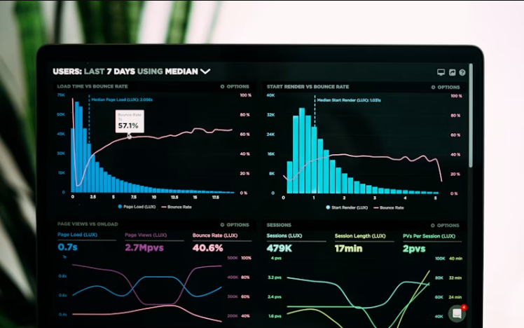
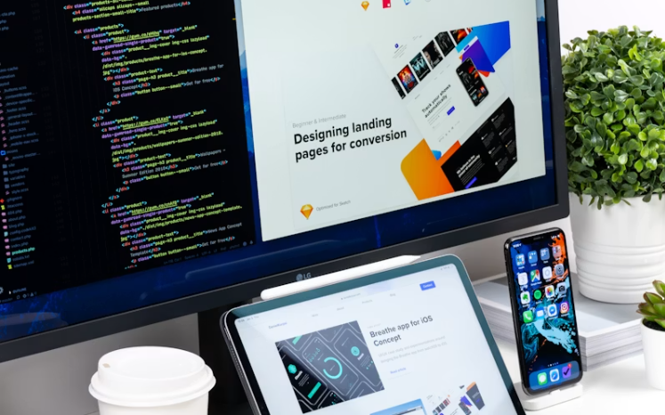
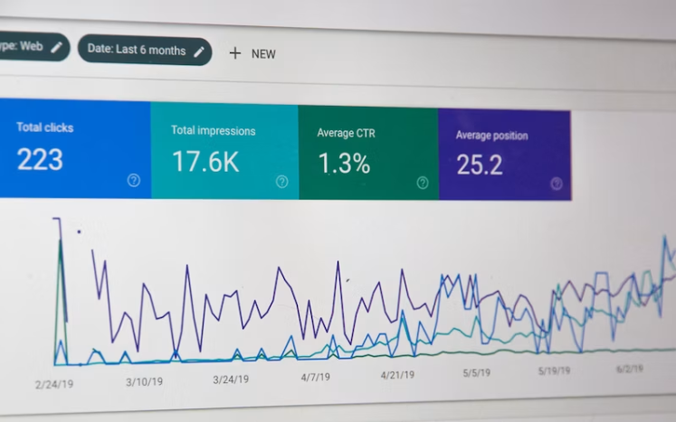

# Shem — Front-end Engineer & Product Designer

A concise portfolio showcasing production-ready web interfaces, end-to-end product thinking, and a selection of shipped projects across web, mobile, and AI domains. Built with HTML, CSS and JavaScript and intended to be served as a static site.

## 🚀 Highlights

- **Showcase of work:** 11+ selected projects including dashboards, CMS platforms, design systems, mobile apps, and AI prototypes.
- **Design → Code:** Clean, responsive layouts with attention to accessibility and performance.
- **Built for hiring:** Fast contact flow and clear project links to live demos and source repositories.

## 🛠️ Tech Stack

- Frontend: HTML5, CSS3, JavaScript (ES6+)
- Common frameworks referenced in projects: React, Next.js, Vue, React Native
- Backend & tooling shown in project descriptions: Node.js, Python (FastAPI), PostgreSQL, MongoDB
- Development: VS Code, Git, modern browsers

## ⚙️ Prerequisites

- Modern web browser (Chrome, Firefox, Edge, Safari)
- Optional: Node.js installed for running a local static server (`npx http-server`) or Python for `python -m http.server`

## 💾 Installation & Local Preview

1. Clone the repository:

```bash
git clone https://github.com/your-username/your-repo-name.git
cd your-repo-name/My\ Portfolio
```

2. Open the site directly: open `index.html` in your browser, or run a local server for correct asset serving:

```bash
# with Node (http-server)
npx http-server -c-1

# or with Python 3
python -m http.server 8000

# then open http://localhost:8080 or http://localhost:8000
```

## 📚 Project Structure

- `index.html` — landing page and entry point for the portfolio
- `style.css` — global styling for the site
- `assets/images/` — hero image, about image and project thumbnails

## 🖼️ Preview

Hero section:


About section:


Project thumbnails (examples):





> Tip: Replace or add screenshots in `assets/images/projects/` to highlight other projects.

## 🔗 Links & Demos

Many project cards include links to live demos and the GitHub sources. Use the project cards on the main page to jump to the example implementations.

## ✅ What I added

- Professional, structured `README.md` for the portfolio with installation, preview and contribution notes.
- Embedded existing screenshots from `assets/images/` for visual context.

## 📤 Pushing to GitHub

I can commit and push this `README.md` to your GitHub repository if you provide the remote URL (for example `https://github.com/your-username/your-repo-name.git`).

Suggested commands to run locally (replace with your repo URL):

```bash
cd "My Portfolio"
git add README.md
git commit -m "docs: add portfolio README"
git remote add origin https://github.com/your-username/your-repo-name.git
git branch -M main
git push -u origin main
```

If you'd like, paste the repository URL here and I will run these steps for you.

## ⚖️ License

This portfolio content is provided as-is. Add a license file if you want to set formal reuse rules (e.g., `MIT`).

## ✉️ Contact

Use the `Contact` section on the site to reach out, or paste your preferred email / social links here and I'll include them in the README.

---

Made with care — open an issue or DM me if you'd like changes to copy, screenshots, or additional deployment instructions.
